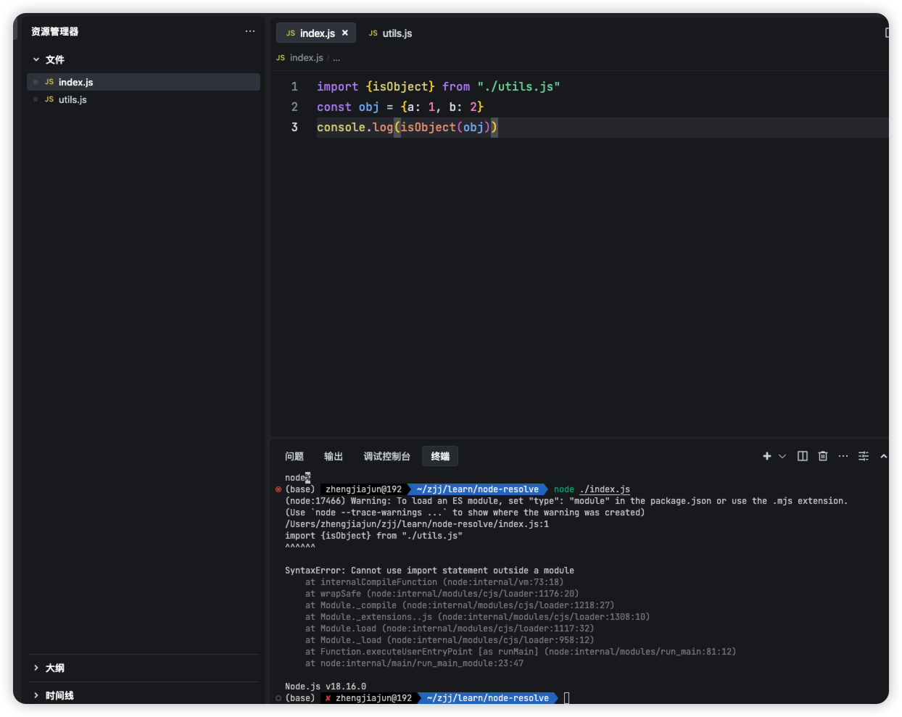
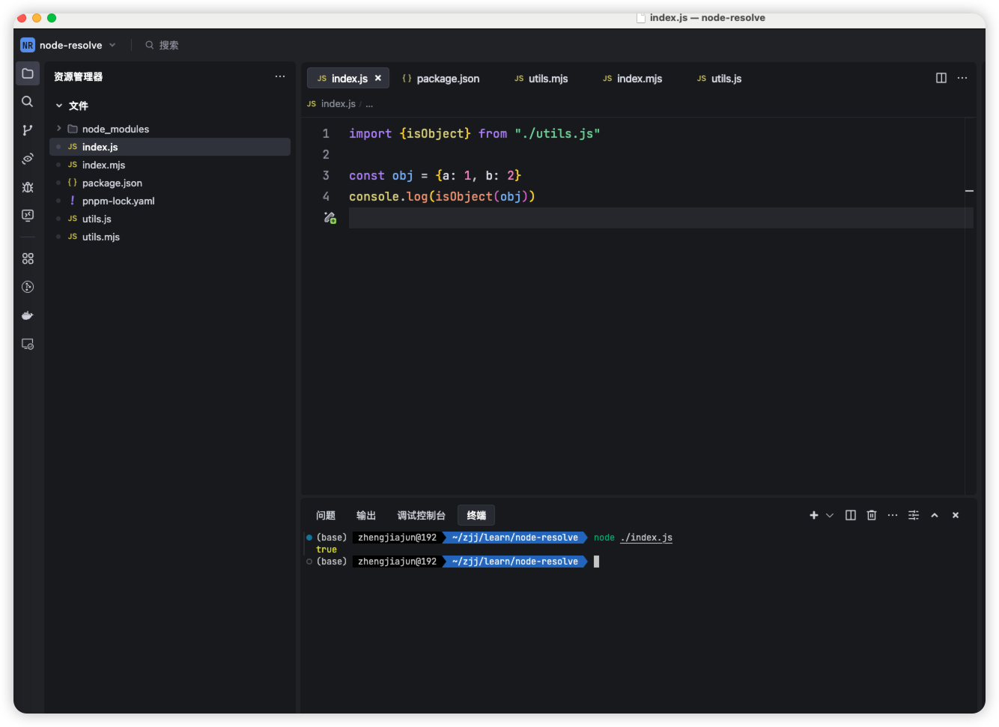

## 目录
- [目录](#目录)
- [Node的模块系统](#node的模块系统)
  - [基本使用](#基本使用)
  - [当加载第三方模块时](#当加载第三方模块时)
    - [Package entry points 包入口点](#package-entry-points-包入口点)
    - [确定模块系统](#确定模块系统)

## Node的模块系统

### 基本使用

当传递给 `node` 或被 `import` 语句或 `import()` 引用时：

以下几种情况会被认为是ES modules

- 以`.mjs`为结尾的文件

  ```bash
  node ./index.mjs
  ```

  ```js
  import {isObject} from "./utils.mjs"
  const obj = {a: 1, b: 2}
  console.log(isObject(obj))
  ```

  

- 当最近的父 `package.json` 文件包含顶级 [`"type"`](https://nodejs.org/api/packages.html#type) 字段且值为 `"module"` 时，扩展名为 `.js` 文件。

  ```bash
  node ./index.js
  ```

  ```js
  import {isObject} from "./utils.js"
  
  const obj = {a: 1, b: 2}
  console.log(isObject(obj))
  ```

  

​		*** 当package.json 的type=module时***

以下内容视为 [CommonJS](https://nodejs.org/api/modules.html) 表达式：

- 以`.cjs`为结尾的文件

- 当最近的父 `package.json` 文件包含顶级字段 [`"type"`](https://nodejs.org/api/packages.html#type) 且值为 `"commonjs"` 时，带有 `.js` 扩展名的文件。

  比如*** 在`.mjs`文件中导入`import {isObject} from "./utils.js"`报错***


### 当加载第三方模块时

#### Package entry points 包入口点

在包的 `package.json` 文件中，有两个字段可以定义包的入口点： [`"main"`](https://nodejs.org/docs/latest-v18.x/api/packages.html#main) 和 [`"exports"`](https://nodejs.org/docs/latest-v18.x/api/packages.html#exports) 。这两个字段都适用于 ES 模块和 CommonJS 模块的入口点。

所有版本的 Node.js 都支持 [`"main"`](https://nodejs.org/docs/latest-v18.x/api/packages.html#main) 字段，但其功能有限：它仅定义包的主要入口点。

[`"exports"`](https://nodejs.org/docs/latest-v18.x/api/packages.html#exports) 提供了 [`"main"`](https://nodejs.org/docs/latest-v18.x/api/packages.html#main) 的现代替代方案，允许定义多个入口点，支持不同环境之间的条件入口解析，并**阻止除 [`"exports"`](https://nodejs.org/docs/latest-v18.x/api/packages.html#exports) 中定义的入口点之外的任何其他入口点** 。这种封装允许模块作者清晰地定义其包的公共接口。

[条件导出](https://nodejs.org/docs/latest-v18.x/api/packages.html#conditional-exports)可以在 [`"exports"`](https://nodejs.org/docs/latest-v18.x/api/packages.html#exports) 中使用，为每个环境定义不同的包入口点，包括包是通过 `require` 还是 `import` 引用。

注意引入 [`"exports"`](https://nodejs.org/docs/latest-v18.x/api/packages.html#exports) 字段的现有软件包将阻止消费者 包使用任何未定义的入口点，包括 [`package.json`](https://nodejs.org/docs/latest-v18.x/api/packages.html#nodejs-packagejson-field-definitions) （例如 `require('your-package/package.json')` 。 

示例

```json
{
  "exports": {
    "import": "./index-module.js",
    "require": "./index-require.cjs"
  },
  "type": "module"
} 
```

参数

- node  匹配任意 Node.js 环境。可以是 CommonJS 或 ES 模块文件。 *大多数情况下，无需明确指定 Node.js 平台。*
- `"import"` - 通过 `import` 或 `import()` ，或通过 ECMAScript 模块加载器的任何顶级 import 或 resolve 操作。无论目标文件的模块格式如何，均适用。 
- `"require"` - 当包通过 `require()` 加载时匹配。引用的文件应该可以通过 `require()` 加载，尽管条件 无论目标文件的模块格式如何，都会匹配
- `"default"` - 始终匹配的通用后备方案。可以是 CommonJS 或 ES 模块文件。 *此条件应始终放在最后。*

在 [`"exports"`](https://nodejs.org/docs/latest-v18.x/api/packages.html#exports) 对象中，键的顺序非常重要。在条件匹配过程中，较早的条目具有更高的优先级，优先于较晚的条目。

条件导出还可以扩展到导出子路径，例如：

```json
{
  "exports": {
    ".": "./index.js",
    "./feature.js": {
      "node": "./feature-node.js",
      "default": "./feature.js"
    }
  }
} 
```

#### 确定模块系统

找到入口文件后根据上面的判断方法确定模块系统