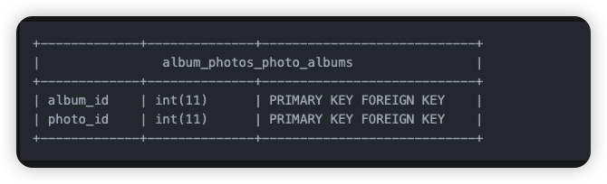

## 目录
- [目录](#目录)
- [docker](#docker)
  - [docker 环境变量设置](#docker-环境变量设置)
  - [docker desktop镜像源设置](#docker-desktop镜像源设置)
  - [Dockerfile简单模版](#dockerfile简单模版)
- [编程范式](#编程范式)
  - [函数式编程特点](#函数式编程特点)
  - [面向对象编程](#面向对象编程)
  - [AOP面向切面编程又称洋葱圈模型](#aop面向切面编程又称洋葱圈模型)
- [Class](#class)
  - [实例属性的新写法](#实例属性的新写法)
  - [Class 表达式](#class-表达式)
  - [静态方法](#静态方法)
  - [静态属性](#静态属性)
  - [私有属性](#私有属性)
  - [继承](#继承)
  - [super关键字](#super关键字)
- [Typescript中的类](#typescript中的类)
  - [类的自身类型](#类的自身类型)
  - [构造函数重载](#构造函数重载)
  - [implements 关键字](#implements-关键字)
  - [override 关键字](#override-关键字)
  - [实例属性的简写形式](#实例属性的简写形式)
- [装饰器Decorator](#装饰器decorator)
  - [简介](#简介)
  - [装饰器的执行步骤如下](#装饰器的执行步骤如下)
  - [装饰器的执行时机](#装饰器的执行时机)
  - [装饰器栗子](#装饰器栗子)
  - [为什么装饰器不能用于函数？](#为什么装饰器不能用于函数)
- [Redis](#redis)
  - [数据库 vs Redis，有什么优缺点？](#数据库-vs-redis有什么优缺点)
  - [为什么 Redis 适合替代数据库的读取？](#为什么-redis-适合替代数据库的读取)
  - [使用场景](#使用场景)
  - [Redis镜像](#redis镜像)
  - [Redis Docker-compose配置](#redis-docker-compose配置)
  - [Redis桌面端客户端](#redis桌面端客户端)
- [nest](#nest)
  - [nest优势](#nest优势)
  - [IOC控制反转和DI依赖注入](#ioc控制反转和di依赖注入)
    - [controller中appService查找顺序](#controller中appservice查找顺序)
  - [生命周期](#生命周期)
  - [nest用模块来组织代码](#nest用模块来组织代码)
  - [DTO和DAO](#dto和dao)
    - [dto 这里推荐使用**类**](#dto-这里推荐使用类)
  - [nest多环境配置](#nest多环境配置)
  - [nest日志模块](#nest日志模块)
  - [nest异常捕获](#nest异常捕获)
  - [nest版本控制](#nest版本控制)
  - [nest高速缓存](#nest高速缓存)
  - [nest邮件服务](#nest邮件服务)
  - [数据库](#数据库)
    - [一对一关系](#一对一关系)
      - [关系的反面](#关系的反面)
      - [使用级联自动保存相关对象](#使用级联自动保存相关对象)
    - [创建多对一/一对多关系](#创建多对一一对多关系)
    - [创建多对多关系](#创建多对多关系)


## docker 

### docker 环境变量设置

```bash
export PATH="/Applications/Docker.app/Contents/Resources/bin:$PATH"
```


### docker desktop镜像源设置

```json
{
  "builder": {
    "gc": {
      "defaultKeepStorage": "20GB",
      "enabled": true
    }
  },
  "experimental": false,
  "registry-mirrors": [
    "https://docker.1ms.run",
    "https://fxcnivqq.mirror.aliyuncs.com",
    "https://docker.hpcloud.cloud",
    "https://docker.m.daocloud.io",
    "https://docker.unsee.tech",
    "https://docker.1panel.live",
    "http://mirrors.ustc.edu.cn",
    "https://docker.chenby.cn",
    "http://mirror.azure.cn",
    "https://dockerpull.org",
    "https://dockerhub.icu",
    "https://hub.rat.dev"
  ]
}
```

### Dockerfile简单模版

```Dockerfile
FROM node:20.11.1
ADD ./ ./
RUN npm i pnpm -g
RUN pnpm i
RUN pnpm build
CMD [ "pnpm","start:prod" ]
EXPOSE 3000
```

## 编程范式

### 函数式编程特点

1. 确定的数据输入、输出；没有副作用，相对独立
2. 引用透明，对IDE友好，易于理解
3. 把功能方法尽可能的抽离作为通用函数进行复用

### 面向对象编程

1. 抽象现象生活中的事物特征，对于理解友好
2. 封装性（高内聚低耦合）、继承性、多态性

### AOP面向切面编程又称洋葱圈模型

1. 扩展功能方便、不影响业务之间的逻辑
2. 逻辑集中管理
3. 更有利于代码复用

```js
class Koa {
  constructor() {
    this.middlewares = []; // 中间件队列
  }

  // 收集中间件
  use(fn) {
    this.middlewares.push(fn);
  }

  // 启动服务并处理请求
  listen(port) {
    const server = require('http').createServer(this.handleRequest());
    server.listen(port);
  }

  // 生成请求处理函数
  handleRequest() {
    const composed = compose(this.middlewares); // 组合中间件
    return async (req, res) => {
      const ctx = { req, res, body: null }; // 上下文对象
      await composed(ctx); // 执行中间件链
      res.end(ctx.body);   // 返回响应
    };
  }
}
```

```js
function compose(middlewares) {
  return function (ctx) {
    let index = -1; // 当前执行中间件的索引

    // 递归执行中间件
    function dispatch(i) {
      if (i <= index) throw new Error('next() called multiple times');
      index = i;
      const fn = middlewares[i] || (() => {}); // 默认空函数
      return Promise.resolve(
        fn(ctx, () => dispatch(i + 1)) // 将 next 指向下一个中间件
      );
    }

    return dispatch(0); // 从第一个中间件开始执行
  };
}
```

## Class

基本上，ES6 的`class`可以看作只是一个语法糖，它的绝大部分功能，ES5 都可以做到，新的`class`写法只是让对象原型的写法更加清晰、更像面向对象编程的语法而已

```js
class Point {
  constructor(x, y) {
    this.x = x;
    this.y = y;
  }

  toString() {
    return '(' + this.x + ', ' + this.y + ')';
  }
}
```

ES6 的类，完全可以看作构造函数的另一种写法。

```js
class Point {
  // ...
}

typeof Point // "function"
Point === Point.prototype.constructor // true
```

事实上，类的所有方法都定义在类的`prototype`属性上面。

类的属性和方法，除非显式定义在其本身（即定义在`this`对象上），否则都是定义在原型上（即定义在`class`上）。

```js
class Point {
  constructor(x, y) {
    this.x = x;
    this.y = y;
  }

  toString() {
    return '(' + this.x + ', ' + this.y + ')';
  }
}

var point = new Point(2, 3);

point.toString() // (2, 3)

point.hasOwnProperty('x') // true
point.hasOwnProperty('y') // true
point.hasOwnProperty('toString') // false
point.__proto__.hasOwnProperty('toString') // true
```

上面代码中，`x`和`y`都是实例对象`point`自身的属性（因为定义在`this`对象上），所以`hasOwnProperty()`方法返回`true`，而`toString()`是原型对象的属性（因为定义在`Point`类上），所以`hasOwnProperty()`方法返回`false`。这些都与 ES5 的行为保持一致。

与 ES5 一样，类的所有实例共享一个原型对象。

```js
var p1 = new Point(2,3);
var p2 = new Point(3,2);

p1.__proto__ === p2.__proto__
//true
```

上面代码中，`p1`和`p2`都是`Point`的实例，它们的原型都是`Point.prototype`，所以`__proto__`属性是相等的。

这也意味着，可以通过实例的`__proto__`属性为“类”添加方法。

> `__proto__` 并不是语言本身的特性，这是各大厂商具体实现时添加的私有属性，虽然目前很多现代浏览器的 JS 引擎中都提供了这个私有属性，但依旧不建议在生产中使用该属性，避免对环境产生依赖。生产环境中，我们可以使用 `Object.getPrototypeOf()` 方法来获取实例对象的原型，然后再来为原型添加方法/属性。

```js
var p1 = new Point(2,3);
var p2 = new Point(3,2);

p1.__proto__.printName = function () { return 'Oops' };

p1.printName() // "Oops"
p2.printName() // "Oops"

var p3 = new Point(4,2);
p3.printName() // "Oops"
```

### 实例属性的新写法

```js
// 原来的写法
class IncreasingCounter {
  constructor() {
    this._count = 0;
  }
  get value() {
    console.log('Getting the current value!');
    return this._count;
  }
  increment() {
    this._count++;
  }
}
```

现在的新写法是，这个属性也可以定义在类的最顶层，其他都不变。

```js
class IncreasingCounter {
  _count = 0;
  get value() {
    console.log('Getting the current value!');
    return this._count;
  }
  increment() {
    this._count++;
  }
}
```

***注意，新写法定义的属性是实例对象自身的属性，而不是定义在实例对象的原型上面。***

### Class 表达式 

```js
const MyClass = class Me {
  getClassName() {
    return Me.name;
  }
};
```

***需要注意的是，这个类的名字是`Me`，但是`Me`只在 Class 的内部可用，指代当前类。在 Class 外部，这个类只能用`MyClass`引用。***

如果类的内部没用到的话，可以省略`Me`

采用 Class 表达式，可以写出立即执行的 Class。

```js
let person = new class {
  constructor(name) {
    this.name = name;
  }

  sayName() {
    console.log(this.name);
  }
}('张三');

person.sayName(); // "张三"
```

### 静态方法

类相当于实例的原型，所有在类中定义的方法，都会被实例继承。如果在一个方法前，加上`static`关键字，就表示该方法不会被实例继承，而是直接通过类来调用，这就称为“静态方法”。

父类的静态方法，可以被子类继承。

### 静态属性

 ES6 明确规定，Class 内部只有静态方法，没有静态属性

```js
class Foo {
}

Foo.prop = 1;
Foo.prop // 1
```

### 私有属性

[ES2022](https://github.com/tc39/proposal-class-fields)正式为`class`添加了私有属性，方法是在属性名之前使用`#`表示。

```js
class IncreasingCounter {
  #count = 0;
  get value() {
    console.log('Getting the current value!');
    return this.#count;
  }
  increment() {
    this.#count++;
  }
}
```

只能在类的内部使用（`this.#count`）。如果在类的外部使用，就会报错。

***注意，[从 Chrome 111 开始](https://developer.chrome.com/blog/new-in-devtools-111/#misc)，开发者工具里面可以读写私有属性，不会报错，原因是 Chrome 团队认为这样方便调试。***

### 继承

ES6 规定，子类必须在`constructor()`方法中调用`super()`，否则就会报错。原因就在于 ES6 的继承机制，与 ES5 完全不同。ES5 的继承机制，是先创造一个独立的子类的实例对象，然后再将父类的方法添加到这个对象上面，即“实例在前，继承在后”。ES6 的继承机制，则是先将父类的属性和方法，加到一个空的对象上面，然后再将该对象作为子类的实例，即“继承在前，实例在后”。这就是为什么 ES6 的继承必须先调用`super()`方法，因为这一步会生成一个继承父类的`this`对象，没有这一步就无法继承父类。

另一个需要注意的地方是，在子类的构造函数中，只有调用`super()`之后，才可以使用`this`关键字，否则会报错。

如果子类没有定义`constructor()`方法，这个方法会默认添加，并且里面会调用`super()`。也就是说，不管有没有显式定义，任何一个子类都有`constructor()`方法。

```js
class ColorPoint extends Point {
}

// 等同于
class ColorPoint extends Point {
  constructor(...args) {
    super(...args);
  }
}
```

### super关键字

`super`这个关键字，既可以当作函数使用，也可以当作对象使用

`super`作为对象时，在普通方法中，指向父类的原型对象；在静态方法中，指向父类。

***这里需要注意，由于`super`指向父类的原型对象，所以定义在父类实例上的方法或属性，是无法通过`super`调用的。***

ES6 规定，在子类普通方法中通过`super`调用父类的方法时，方法内部的`this`指向当前的子类实例。

```js
class A {
  constructor() {
    this.x = 1;
  }
  print() {
    console.log(this.x);
  }
}

class B extends A {
  constructor() {
    super();
    this.x = 2;
  }
  m() {
    super.print();
  }
}

let b = new B();
b.m() // 2
```

## Typescript中的类

TypeScript 的类本身就是一种类型，但是它代表该类的实例类型，而不是 class 的自身类型。

### 类的自身类型

作为类型使用时，类名只能表示实例的类型，不能表示类的自身类型。

```typescript
class Point {
  x:number;
  y:number;

  constructor(x:number, y:number) {
    this.x = x;
    this.y = y;
  }
}

// 错误
function createPoint(
  PointClass:Point,
  x: number,
  y: number
) {
  return new PointClass(x, y);
}
```

要获得一个类的自身类型，一个简便的方法就是使用 typeof 运算符。

```typescript
function createPoint(
  PointClass:typeof Point,
  x:number,
  y:number
):Point {
  return new PointClass(x, y);
}
```

JavaScript 语言中，类只是构造函数的一种语法糖，本质上是构造函数的另一种写法。所以，类的自身类型可以写成构造函数的形式。

```typescript
function createPoint(
  PointClass: new (x:number, y:number) => Point,
  x: number,
  y: number
):Point {
  return new PointClass(x, y);
}
```

构造函数也可以写成对象形式，所以参数`PointClass`的类型还有另一种写法。

```typescript
function createPoint(
  PointClass: {
    new (x:number, y:number): Point
  },
  x: number,
  y: number
):Point {
  return new PointClass(x, y);
}
```


### 构造函数重载

```typescript
class Point {
  constructor(x:number, y:string);
  constructor(s:string);
  constructor(xs:number|string, y?:string) {
    // ...
  }
}
```

### implements 关键字 

```typescript
interface Country {
  name:string;
  capital:string;
}
// 或者
type Country = {
  name:string;
  capital:string;
}

class MyCountry implements Country {
  name = '';
  capital = '';
}
```

`implements`关键字后面，不仅可以是接口，也可以是另一个类。这时，后面的类将被当作接口。

```typescript
class Car {
  id:number = 1;
  move():void {};
}

class MyCar implements Car {
  id = 2; // 不可省略
  move():void {};   // 不可省略
}
```

对于引用实例对象的变量来说，既可以声明类型为 Class，也可以声明类型为 Interface，因为两者都代表实例对象的类型。

```typescript
interface MotorVehicle {
}

class Car implements MotorVehicle {
}

// 写法一
const c1:Car = new Car();
// 写法二
const c2:MotorVehicle = new Car();
```

它们的区别是，如果类`Car`有接口`MotorVehicle`没有的属性和方法，那么只有变量`c1`可以调用这些属性和方法。

### override 关键字

子类继承父类时，可以覆盖父类的同名方法。

但是有些时候，我们继承他人的类，可能会在不知不觉中，就覆盖了他人的方法。为了防止这种情况，TypeScript 4.3 引入了 [override 关键字](https://www.typescriptlang.org/docs/handbook/release-notes/typescript-4-3.html#override-and-the---noimplicitoverride-flag)。

```typescript
class B extends A {
  override show() {
    // ...
  }
  override hide() {
    // ...
  }
}
```

### 实例属性的简写形式

实际开发中，很多实例属性的值，是通过构造方法传入的。

```typescript
class Point {
  x:number;
  y:number;

  constructor(x:number, y:number) {
    this.x = x;
    this.y = y;
  }
}
```

这样的写法等于对同一个属性要声明两次类型，一次在类的头部，另一次在构造方法的参数里面。这有些累赘，TypeScript 就提供了一种简写形式。

```typescript
class Point {
  constructor(
    public x:number,
    public y:number
  ) {}
}

const p = new Point(10, 10);
p.x // 10
p.y // 10
```


## 装饰器Decorator

### 简介

装饰器（Decorator）用来增强 JavaScript 类（class）的功能

装饰器是一种函数，写成`@ + 函数名`，可以用来装饰四种类型的值。

- 类
- 类的属性
- 类的方法
- 属性存取器（accessor）

### 装饰器的执行步骤如下

1. 计算各个装饰器的值，按照从左到右，从上到下的顺序。
2. 调用方法装饰器。
3. 调用类装饰器。

### 装饰器的执行时机

个人觉得是立即执行的，如果在模块中，则在模块导入时就立即执行

### 装饰器栗子

1. 类装饰器

   类装饰器可以返回一个新的类，取代原来的类，也可以不返回任何值

   ```typescript
   function logged(value, { kind, name }) {
     if (kind === "class") {
       return class extends value {
         constructor(...args) {
           super(...args);
           console.log(`constructing an instance of ${name} with arguments ${args.join(", ")}`);
         }
       }
     }
   
     // ...
   }
   
   @logged
   class C {}
   
   new C(1);
   // constructing an instance of C with arguments 1
   ```

   如果不使用装饰器，类装饰器实际上执行的是下面的语法。

   ```typescript
   class C {}
   
   C = logged(C, {
     kind: "class",
     name: "C",
   }) ?? C;
   
   new C(1);
   
   ```

   

2. 方法装饰器

   方法装饰器可以返回一个新函数，取代原来的方法，也可以不返回值，表示依然使用原来的方法

   ```typescript
   function logged(value, { kind, name }) {
     if (kind === "method") {
       return function (...args) {
         console.log(`starting ${name} with arguments ${args.join(", ")}`);
         const ret = value.call(this, ...args);
         console.log(`ending ${name}`);
         return ret;
       };
     }
   }
   
   class C {
     @logged
     m(arg) {}
   }
   
   new C().m(1);
   // starting m with arguments 1
   // ending m
   ```

   这里的装饰器实际上是一个语法糖，真正的操作是像下面这样，改掉原型链上面`m()`方法。

   ```typescript
   class C {
     m(arg) {}
   }
   
   C.prototype.m = logged(C.prototype.m, {
     kind: "method",
     name: "m",
     static: false,
     private: false,
   }) ?? C.prototype.m;
   ```

3. 存取器装饰器

   存取器装饰器的返回值如果是一个函数，就会取代原来的存取器。本质上，就像方法装饰器一样，修改发生在类的原型对象上。它也可以不返回任何值，继续使用原来的存取器

   ```typescript
   function logged(value, { kind, name }) {
     if (kind === "method" || kind === "getter" || kind === "setter") {
       return function (...args) {
         console.log(`starting ${name} with arguments ${args.join(", ")}`);
         const ret = value.call(this, ...args);
         console.log(`ending ${name}`);
         return ret;
       };
     }
   }
   
   class C {
     @logged
     set x(arg) {}
   }
   
   new C().x = 1
   // starting x with arguments 1
   // ending x
   ```

   如果去掉语法糖，使用传统语法来写，就是改掉了类的原型链。

   ```typescript
   class C {
     set x(arg) {}
   }
   
   let { set } = Object.getOwnPropertyDescriptor(C.prototype, "x");
   set = logged(set, {
     kind: "setter",
     name: "x",
     static: false,
     private: false,
   }) ?? set;
   
   Object.defineProperty(C.prototype, "x", { set });
   ```

4. 属性装饰器

   用户可以选择让装饰器返回一个初始化函数，当该属性被赋值时，这个初始化函数会自动运行，它会收到属性的初始值，然后返回一个新的初始值。属性装饰器也可以不返回任何值

   ```typescript
   function logged(value, { kind, name }) {
     if (kind === "field") {
       return function (initialValue) {
         console.log(`initializing ${name} with value ${initialValue}`);
         return initialValue;
       };
     }
   
     // ...
   }
   
   class C {
     @logged x = 1;
   }
   
   new C();
   // initializing x with value 1
   ```

   如果不使用装饰器语法，属性装饰器的实际作用如下。

   ```typescript
   let initializeX = logged(undefined, {
     kind: "field",
     name: "x",
     static: false,
     private: false,
   }) ?? (initialValue) => initialValue;
   
   class C {
     x = initializeX.call(this, 1);
   }
   ```

   

### 为什么装饰器不能用于函数？

装饰器只能用于类和类的方法，不能用于函数，因为存在函数提升。如果一定要装饰函数，可以采用高阶函数的形式直接执行。

## Redis

### 数据库 vs Redis，有什么优缺点？

数据库支持：数据持久性、事务支持、复杂查询支持，缺点是读取速度上与内存相比差很多，可扩展性上价格贵；

Redis：读取速度快、易扩展、数据结构丰富，但是数据容量受限、成本也高、不容易处理复杂查询、持久性会存在问题

### 为什么 Redis 适合替代数据库的读取？

由于 Redis 的高速读取能力，它非常适合作为数据库的缓存层，尤其在高读取、低写入的场景中。当应用需要频繁读取同一数据时，使用 Redis 可以大幅减少对数据库的访问次数，从而减轻数据库的压力并提高总体性能。

### 使用场景

- 短信验证码

### Redis镜像

官方镜像：`https://hub.docker.com/_/redis`

第三方镜像：`https://hub.docker.com/r/bitnami/redis`

> 哪个镜像好？
>
> 官方镜像就只提供了一个redis-server命令
>
> bitnami提供了非常丰富的环境变量与功能，参考说明文档：https://github.com/bitnami/containers/blob/main/bitnami/redis/README.md

### Redis Docker-compose配置

```yaml
version: "3.8"
services:
  redis:
    image: redis:latest
    container_name: redis
    restart: always
    volumes:
      - redis_volume_data:/data
    ports:
      - 6379:6379
      

volumes:
  redis_volume_data:
```

### [Redis桌面端客户端](https://github.com/qishibo/AnotherRedisDesktopManager)

## [nest](https://docs.nestjs.cn/10/introduction)

### nest优势

1. 企业级框架提供了非常多的通用功能，主要有数据校验、数据库链接、权限控制、日志服务、错误异常、接口文档、多环境配置
2. 生态大而全 

### IOC控制反转和DI依赖注入

IOC是一种设计模式，DI是IOC的具体实现

依赖注入它允许再类外创建依赖对象，并通过不同的形式将这些对象提供给类，通过通用接口的形式，实现了类和依赖之间的解耦


#### controller中appService查找顺序

1. 首先看app module中providers没有AppService

2. 没有AppService 则找imports -> 其它module ->其它模块 providers+exports -> AppService

3. 有, providers直接提供 -> AppService 

### 生命周期


### nest用模块来组织代码

 

- 如何设置全局模块

  用任意 module中`@Global()+providers+exports`

  ***使一切全局化并不是一个好的解决方案。 全局模块可用于减少必要模板文件的数量。 `imports` 数组仍然是使模块 API 透明的最佳方式。***

- 如何设置动态模块

  用`useFactory+injest`

  ```typescript
  imports: [
    WinstonModule.forRootAsync({
      useFactory: (configService: ConfigService) => {
        const log_output =
          configService.get<string>('LOG_OUTPUT', 'false') === 'true';
        const options = createLoggerOptions(log_output);
        return options;
      },
      inject: [ConfigService],
    }),
  ],
  ```

  

### DTO和DAO


dto 是的请求参数校验的TS类型层，DAO的数据库的TS实体类型层

#### dto 这里推荐使用**类**

由于 TypeScript 接口在转换过程中被删除，所以 Nest 不能在运行时引用它们。这一点很重要，因为诸如**管道**（Pipe）之类的特性为在运行时访问变量的元类型提供更多的可能性。

```typescript
export class CreateCatDto {
  readonly name: string;
  readonly age: number;
  readonly breed: string;
}
```

```typescript
@Post()
async create(@Body() createCatDto: CreateCatDto) {
  return 'This action adds a new cat';
}
```

`@Body() `是注入的参数装饰器，由nest实现

### [nest多环境配置](https://nest.nodejs.cn/techniques/configuration)

### [nest日志模块](https://github.com/gremo/nest-winston/tree/main)

- 为啥要在APP module中providers `@nestjs/common`的Logger?

  应为winston是全局替换`@nestjs/common`的Logger对象，原来的`@nestjs/common`的Logger对象被替 换掉了

- [滚动日志](https://github.com/winstonjs/winston-daily-rotate-file)

### [nest异常捕获](https://nest.nodejs.cn/exception-filters#%E6%8D%95%E8%8E%B7%E4%B8%80%E5%88%87)

- 在全局异常捕获中动态判断是否是http异常

- 注册全局作用域的过滤器

```typescript

import { Module } from '@nestjs/common';
import { APP_FILTER } from '@nestjs/core';

@Module({
  providers: [
    {
      provide: APP_FILTER,
      useClass: HttpExceptionFilter,
    },
  ],
})
export class AppModule {}

```

### [nest版本控制](https://nest.nodejs.cn/techniques/versioning#%E7%94%A8%E6%B3%95)

### [nest高速缓存](https://docs.nestjs.com/techniques/caching)

### [nest邮件服务](https://nest-modules.github.io/mailer/docs/mailer.html)

- [**Handlebars模版**](https://handlebarsjs.com/)

- [邮箱SMTPS服务](https://wx.mail.qq.com/account/index?sid=zTxNS4xQSUkuxDNvAJRieQAA#/?tab=safety&r=1746333737487)

***不需要全局注入？？？MailerService***

### [数据库](https://docs.nestjs.com/techniques/database)

- 客户端链接时 Public Key Retrieval is not allowed

  **临时测试**：通过 `allowPublicKeyRetrieval=true` 快速绕过限制，但需注意安全风险。

- [typeorm](https://typeorm.io/)

#### 一对一关系

```typescript
import {
    Entity,
    Column,
    PrimaryGeneratedColumn,
    OneToOne,
    JoinColumn,
} from "typeorm"
import { Photo } from "./Photo"

@Entity()
export class PhotoMetadata {
    @PrimaryGeneratedColumn()
    id: number

    @Column()
    comment: string

    @OneToOne(() => Photo)
    @JoinColumn()
    photo: Photo
}
```

这里，我们使用了一个名为 的新装饰器`@OneToOne`。它允许我们在两个实体之间创建一对一关系。我们还添加了一个`@JoinColumn`装饰器，用于指示关系的这一方将拥有该关系。关系可以是单向的，也可以是双向的。只有关系的一方可以拥有该关系。`@JoinColumn`关系的拥有方必须使用装饰器。


##### 关系的反面

关系可以是单向的，也可以是双向的。目前，PhotoMetadata 和 Photo 之间的关系是单向的。该关系的所有者是 PhotoMetadata，而 Photo 对 PhotoMetadata 一无所知。这使得从 Photo 端访问 PhotoMetadata 变得复杂。为了解决这个问题，我们应该添加一个反向关系，并使 PhotoMetadata 和 Photo 之间的关系成为双向的。

```typescript
import {
    Entity,
    Column,
    PrimaryGeneratedColumn,
    OneToOne,
    JoinColumn,
} from "typeorm"
import { Photo } from "./Photo"

@Entity()
export class PhotoMetadata {
    /* ... other columns */

    @OneToOne(() => Photo, (photo) => photo.metadata)
    @JoinColumn()
    photo: Photo
}
```

```typescript
import { Entity, Column, PrimaryGeneratedColumn, OneToOne } from "typeorm"
import { PhotoMetadata } from "./PhotoMetadata"

@Entity()
export class Photo {
    /* ... other columns */

    @OneToOne(() => PhotoMetadata, (photoMetadata) => photoMetadata.photo)
    metadata: PhotoMetadata
}
```

`photo => photo.metadata`是一个返回关系反面名称的函数。这里我们展示了 Photo 类的元数据属性，它是我们在 Photo 类中存储照片元数据的地方。除了传递返回照片属性的函数之外，您还可以简单地将字符串传递给`@OneToOne`装饰器，例如`"metadata"`。但我们使用了这种函数类型的方法，以便于重构。

`@JoinColumn`请注意，我们只能在关系的一侧使用装饰器。无论你将此装饰器放在哪一侧，它都将成为关系的拥有方。关系的拥有方包含数据库中带有外键的列。

现在，让我们在一个查询中加载照片及其照片元数据

```typescript
import { Photo } from "./entity/Photo"
import { PhotoMetadata } from "./entity/PhotoMetadata"
import { AppDataSource } from "./index"

const photoRepository = AppDataSource.getRepository(Photo)
const photos = await photoRepository.find({
    relations: {
        metadata: true,
    },
})
```

##### 使用级联自动保存相关对象

我们可以在关系中设置级联选项，这样当我们希望在保存其他对象时也保存相关对象时，就可以使用级联选项了。让我们`@OneToOne`稍微修改一下照片的装饰器：

```typescript
export class Photo {
    // ... other columns

    @OneToOne(() => PhotoMetadata, (metadata) => metadata.photo, {
        cascade: true,
    })
    metadata: PhotoMetadata
}
```

```typescript
import { AppDataSource } from "./index"

// create photo object
const photo = new Photo()
photo.name = "Me and Bears"
photo.description = "I am near polar bears"
photo.filename = "photo-with-bears.jpg"
photo.isPublished = true

// create photo metadata object
const metadata = new PhotoMetadata()
metadata.height = 640
metadata.width = 480
metadata.compressed = true
metadata.comment = "cybershoot"
metadata.orientation = "portrait"

photo.metadata = metadata // this way we connect them

// get repository
const photoRepository = AppDataSource.getRepository(Photo)

// saving a photo also save the metadata
await photoRepository.save(photo)

console.log("Photo is saved, photo metadata is saved too.")
```

请注意，我们现在设置的是照片的`metadata`属性，而不是像以前那样设置元数据的`photo`属性。此`cascade`功能仅当您从照片端将照片与其元数据关联时才有效。如果您从元数据端设置，则元数据不会自动保存。

#### 创建多对一/一对多关系

让我们创建一个多对一/一对多关系。假设一张照片对应一位作者，每位作者可以拥有多张照片。首先，让我们创建一个`Author`类：

```typescript
import {
    Entity,
    Column,
    PrimaryGeneratedColumn,
    OneToMany,
    JoinColumn,
} from "typeorm"
import { Photo } from "./Photo"

@Entity()
export class Author {
    @PrimaryGeneratedColumn()
    id: number

    @Column()
    name: string

    @OneToMany(() => Photo, (photo) => photo.author) // note: we will create author property in the Photo class below
    photos: Photo[]
}

```

`Author`包含关系的逆侧。 `OneToMany`始终是关系的逆侧，并且它不能脱离`ManyToOne`关系的另一侧而存在。

现在让我们将关系的所有者方添加到照片实体中：

```typescript
import { Entity, Column, PrimaryGeneratedColumn, ManyToOne } from "typeorm"
import { PhotoMetadata } from "./PhotoMetadata"
import { Author } from "./Author"

@Entity()
export class Photo {
    /* ... other columns */

    @ManyToOne(() => Author, (author) => author.photos)
    author: Author
}
```

在多对一/一对多关系中，所有者方始终是多对一的。这意味着使用对象的类`@ManyToOne`将存储相关对象的 ID。

运行应用程序后，ORM 将创建`author`表：


#### 创建多对多关系

让我们创建一个多对多关系。假设一张照片可以存在于多个相册中，每个相册可以包含多张照片。让我们创建一个`Album`类：

```typescript
import {
    Entity,
    PrimaryGeneratedColumn,
    Column,
    ManyToMany,
    JoinTable,
} from "typeorm"

@Entity()
export class Album {
    @PrimaryGeneratedColumn()
    id: number

    @Column()
    name: string

    @ManyToMany(() => Photo, (photo) => photo.albums)
    @JoinTable()
    photos: Photo[]
}

```

`@JoinTable`需要指定这是关系的所有者方。

现在让我们将关系的反面添加到`Photo`类中：

```typescript
export class Photo {
    // ... other columns

    @ManyToMany(() => Album, (album) => album.photos)
    albums: Album[]
}
```

运行应用程序后，ORM 将创建一个**album_photos_photo_albums** *连接表*：


