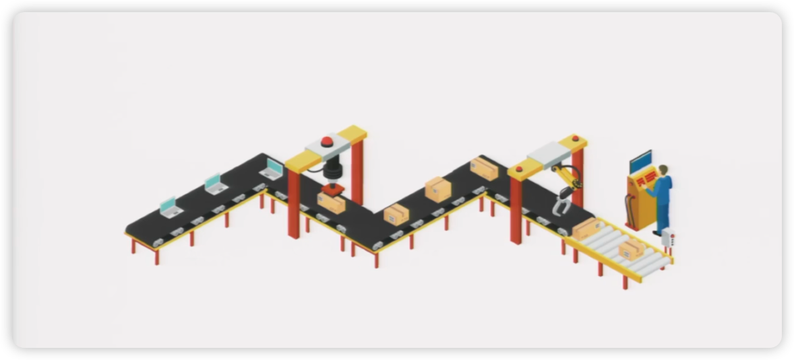

## 什么是rxjs

Rxjs 可以透过observable来组合各种异步行为，简化代码和提高程序的可读性和可维护性



RxJS 的强大之处在于它能够使用纯函数来生成值。这意味着你的代码不容易出错。

通常你会创建一个不纯的函数，其中代码的其他部分可能会扰乱你的状态。

```js
let count = 0;
document.addEventListener('click', () => console.log(`Clicked ${++count} times`));
```

使用 RxJS 您可以隔离状态。

```js
import { fromEvent, scan } from 'rxjs';

fromEvent(document, 'click')
  .pipe(scan((count) => count + 1, 0))
  .subscribe((count) => console.log(`Clicked ${count} times`));
```

## 可观察对象Observable

Observable 是惰性推送的多个值的集合。它是生产者

Observable 在订阅时立即（同步）推送值

```js
import { Observable } from 'rxjs';

const observable = new Observable((subscriber) => {
  subscriber.next(1);
  subscriber.next(2);
  subscriber.next(3);
  setTimeout(() => {
    subscriber.next(4);
    subscriber.complete();
  }, 1000);
});

console.log('just before subscribe');
observable.subscribe({
  next(x) {
    console.log('got value ' + x);
  },
  error(err) {
    console.error('something wrong occurred: ' + err);
  },
  complete() {
    console.log('done');
  },
});
console.log('just after subscribe');
```

在控制台上执行如下：

```bash
just before subscribe
got value 1
got value 2
got value 3
just after subscribe
got value 4
done
```

### 拉与推

- **什么是拉取？**在拉取系统中，消费者决定何时从数据生产者接收数据。生产者本身并不知道数据何时会交付给消费者。

  每个 JavaScript 函数都是一个拉取系统。函数是数据的生产者，而调用该函数的代码则通过从其调用中“拉取”*单个返回值来消费数据。*

- **什么是推送？**在推送系统中，生产者决定何时向消费者发送数据。消费者并不知道何时会收到数据。

  Promise 是目前 JavaScript 中最常见的推送系统类型。Promise（生产者）将解析后的值传递给已注册的回调函数（消费者）。但与函数不同的是，Promise 负责精确地确定何时将该值“推送”给回调函数

***RxJS 引入了 Observables，一个全新的 JavaScript 推送系统。Observables 是多个值的生产者，并将它们“推送”给观察者（消费者）。***


### Observable 和函数之间有什么区别？

**Observable 可以随时间“返回”多个值**，而函数则不能

```js
function foo() {
  console.log('Hello');
  return 42;
  return 100; // dead code. will never happen
}
```

函数只能返回一个值。然而，Observable 可以这样做：

```js
import { Observable } from 'rxjs';

const foo = new Observable((subscriber) => {
  console.log('Hello');
  subscriber.next(42);
  subscriber.next(100); // "return" another value
  subscriber.next(200); // "return" yet another
});

console.log('before');
foo.subscribe((x) => {
  console.log(x);
});
console.log('after');
```

### subscribe订阅

`addEventListener`这与/等事件处理 API 截然不同`removeEventListener`。使用 时`observable.subscribe`，指定的观察者不会在可观察对象中注册为监听器。可观察对象甚至不会维护已连接的观察者列表。

调用`subscribe`只是一种启动“可观察执行”并向该执行的观察者传递值或事件的方式。

*在 Observable Execution 中，可以发送零到无限个 Next 通知。如果发送了 Error 或 Complete 通知，则之后将不再发送其他通知。*

### *unsubscribe*取消执行

原理伪代码

```js
import { Observable } from 'rxjs';

const observable = new Observable(function subscribe(subscriber) {
  // Keep track of the interval resource
  const intervalId = setInterval(() => {
    subscriber.next('hi');
  }, 1000);

  // Provide a way of canceling and disposing the interval resource
  return function unsubscribe() {
    clearInterval(intervalId);
  };
});
```

## 观察者observer

观察者只是一组回调函数

```js
const observer = {
  next: x => console.log('Observer got a next value: ' + x),
  error: err => console.error('Observer got an error: ' + err),
  complete: () => console.log('Observer got a complete notification'),
};
```

当订阅时`Observable`，您也可以只提供下一个回调作为参数，而不附加到`Observer`对象，例如像这样：

```js
observable.subscribe(x => console.log('Observer got a next value: ' + x));
```

在内部`observable.subscribe`，它将`Observer`使用回调参数作为`next`处理程序创建一个对象。

## RxJS 操作符

### pipe

当调用 Pipeable 操作符时，它们不会*改变*现有的 Observable 实例，而是返回一个*新的*Observable，其订阅逻辑基于第一个 Observable。

### of

**创建运算符**是另一种运算符，可以作为独立函数调用来创建新的可观察对象

例如：`of(1, 2, 3)`创建一个可观察对象

### map

```js
import { of, map } from 'rxjs';

of(1, 2, 3)
  .pipe(map((x) => x * x))
  .subscribe((v) => console.log(`value: ${v}`));

// Logs:
// value: 1
// value: 4
// value: 9
```

### first

```js
import { of, first } from 'rxjs';

of(1, 2, 3)
  .pipe(first())
  .subscribe((v) => console.log(`value: ${v}`));

// Logs:
// value: 1
```


### 高阶可观察量

可观察对象通常发射普通值，例如字符串和数字，但令人惊讶的是，它经常需要处理可观察对象*的*可观察对象

```js
const fileObservable = urlObservable.pipe(map((url) => http.get(url)));
```

`http.get()`为每个 URL 返回一个 Observable（可能是字符串或字符串数组）。现在，你得到了一个Observable*的*Observable ，一个高阶 Observable。

但是如何使用高阶 Observable 呢？通常，我们会通过*扁平化的方式*，将高阶 Observable 转换成普通的 Observable。

```js
const fileObservable = urlObservable.pipe(
  map((url) => http.get(url)),
  concatAll()
);
```

其他有用的展平操作符（称为[*连接操作符*](https://rxjs.dev/guide/operators#join-operators)）包括

- [`mergeAll()`](https://rxjs.dev/api/operators/mergeAll)— 订阅每个到达的内部 Observable，然后发出到达的每个值。作用相当于flat
- [`switchAll()`](https://rxjs.dev/api/operators/switchAll)— 当第一个内部 Observable 到达时订阅它，并在它到达时发出每个值，但是当下一个内部 Observable 到达时，取消对前一个 Observable 的订阅，并订阅新的 Observable。
- [`exhaustAll()`](https://rxjs.dev/api/operators/exhaustAll)— 在第一个内部 Observable 到达时订阅它，并在其到达时发出每个值，丢弃所有新到达的内部 Observable，直到第一个 Observable 完成，然后等待下一个内部 Observable。

`mergeMap`、`switchMap`、` exhaustMap`这三个是和上面的作用保持一致并且加上map

### 大理石图


### [操作符分类](https://rxjs.dev/guide/operators)

## 订阅subscription

订阅是一个表示可释放资源的对象，通常表示可观察对象的执行。订阅有一个重要的方法，`unsubscribe`它不接受任何参数，仅用于释放订阅持有的资源

```js
import { interval } from 'rxjs';

const observable = interval(1000);
const subscription = observable.subscribe(x => console.log(x));
// Later:
// This cancels the ongoing Observable execution which
// was started by calling subscribe with an Observer.
subscription.unsubscribe();
```

订阅也可以组合在一起，这样对`unsubscribe()`一个订阅的调用就可以取消多个订阅。你可以通过将一个订阅“添加”到另一个订阅中来实现这一点：

```js
import { interval } from 'rxjs';

const observable1 = interval(400);
const observable2 = interval(300);

const subscription = observable1.subscribe(x => console.log('first: ' + x));
const childSubscription = observable2.subscribe(x => console.log('second: ' + x));

subscription.add(childSubscription);

setTimeout(() => {
  // Unsubscribes BOTH subscription and childSubscription
  subscription.unsubscribe();
}, 1000);
```

## 主题Subject

**什么是 Subject？** RxJS Subject 是一种特殊类型的 Observable，允许将值多播给多个 Observer

个人理解相当于addEventListener监听事件

```js
import { Subject } from 'rxjs';

const subject = new Subject<number>();

subject.subscribe({
  next: (v) => console.log(`observerA: ${v}`),
});
subject.subscribe({
  next: (v) => console.log(`observerB: ${v}`),
});

subject.next(1);
subject.next(2);

// Logs:
// observerA: 1
// observerB: 1
// observerA: 2
// observerB: 2
```

个人理解`subscribe`没有立即执行是因为没有值

由于 Subject 是观察者，这也意味着你可以将 Subject 作为任何 Observable 的参数`subscribe` ***作用： 将observable单播转为多播***

```js
import { Subject, from } from 'rxjs';

const subject = new Subject<number>();

subject.subscribe({
  next: (v) => console.log(`observerA: ${v}`),
});
subject.subscribe({
  next: (v) => console.log(`observerB: ${v}`),
});

const observable = from([1, 2, 3]);

observable.subscribe(subject); // You can subscribe providing a Subject

// Logs:
// observerA: 1
// observerB: 1
// observerA: 2
// observerB: 2
// observerA: 3
// observerB: 3
```

### BehaviorSubject

Subject 的一个变体是`BehaviorSubject`，它有一个“当前值”的概念。它存储发送给消费者的最新值，每当有新的观察者订阅时，它都会立即从 接收“当前值” `BehaviorSubject`。

```js
import { BehaviorSubject } from 'rxjs';
const subject = new BehaviorSubject(0); // 0 is the initial value

subject.subscribe({
  next: (v) => console.log(`observerA: ${v}`),
});

subject.next(1);
subject.next(2);

subject.subscribe({
  next: (v) => console.log(`observerB: ${v}`),
});

subject.next(3);

// Logs
// observerA: 0
// observerA: 1
// observerA: 2
// observerB: 2
// observerA: 3
// observerB: 3
```

### [ReplaySubject](https://rxjs.dev/api/index/class/ReplaySubject)

- 第一个参数表示重播的值的数量
- 第二个参数表示缓存时间

```js
import { ReplaySubject } from 'rxjs';
const subject = new ReplaySubject(100, 500 /* windowTime */);

subject.subscribe({
  next: (v) => console.log(`observerA: ${v}`),
});

let i = 1;
setInterval(() => subject.next(i++), 200);

setTimeout(() => {
  subject.subscribe({
    next: (v) => console.log(`observerB: ${v}`),
  });
}, 1000);

// Logs
// observerA: 1
// observerA: 2
// observerA: 3
// observerA: 4
// observerA: 5
// observerB: 3
// observerB: 4
// observerB: 5
// observerA: 6
// observerB: 6
// ...
```

### AsyncSubject 

AsyncSubject 是一种变体，其中仅将 Observable 执行的最后一个值发送给其观察者，并且仅当执行完成时才会发送。

```js
import { AsyncSubject } from 'rxjs';
const subject = new AsyncSubject();

subject.subscribe({
  next: (v) => console.log(`observerA: ${v}`),
});

subject.next(1);
subject.next(2);
subject.next(3);
subject.next(4);

subject.subscribe({
  next: (v) => console.log(`observerB: ${v}`),
});

subject.next(5);
subject.complete();

// Logs:
// observerA: 5
// observerB: 5
```

## 调度器**Scheduler**

**什么是调度程序？**调度程序控制订阅何时启动以及通知何时发送。它由三个组件组成。

- **调度程序是一种数据结构。**它知道如何根据优先级或其他标准存储和排队任务。
- **Scheduler 是一个执行上下文。**它指定了任务的执行地点和时间（例如，立即执行，或者通过其他回调机制（例如 setTimeout 或 process.nextTick，或者动画帧）执行）。
- **调度器有一个（虚拟）时钟。**它通过调度器上的 getter 方法提供“时间”的概念`now()`。在特定调度器上调度的任务将仅遵循该时钟指示的时间。

## ` @vueuse/rxjs `

### useObservable原理

```js
export function useObservable<H, I = undefined>(
  observable: Observable<H>,
  options?: UseObservableOptions<I | undefined>,
): Readonly<Ref<H | I>> {
  const value = deepRef<H | I | undefined>(options?.initialValue)
  const subscription = observable.subscribe({
    next: val => (value.value = (val as UnwrapRef<H>)),
    error: options?.onError,
  })
  tryOnScopeDispose(() => {
    subscription.unsubscribe()
  })
  return value as Readonly<Ref<H | I>>
}
```

1. 内部新建一个响应式对象
2. 订阅传入的可观察对象Observable，在next回调里把执行完的值赋值给响应式对象
3. 返回响应式对象

### fromEvent原理

```typescript
export function fromEvent<T extends HTMLElement>(value: MaybeRef<T>, event: string): Observable<Event> {
  if (isRef<T>(value)) {
    return new Observable((subscriber) => {
      let innerSub: Subscription | undefined
      return watch(value, (element) => {
        innerSub?.unsubscribe()
        if (element instanceof HTMLElement) {
          innerSub = fromEventRx(element, event).subscribe(subscriber)
          subscriber.add(innerSub)
        }
      }, { immediate: true })
    })
  }
  return fromEventRx(value, event)
}
```

- 如果是是响应式对象，则新建一个可观察对象Observable，返回一个监听传入响应式对象的watch，如果DOM元素挂载，则内部新建一个内部可观察对象Observable并订阅，订阅的回调引用的外部的Observable的subscriber，并把`innerSub`（事件订阅对象）添加到 `subscriber` 的订阅管理中。这样做的好处是，当 `subscriber` 的生命周期结束时，会自动取消所有子订阅，包括 `innerSub`。

- 如果不是的话，直接调用原生的`fromEvent`生成可观察对象Observable

### 分页查询栗子🌰

```vue
<script setup lang="ts">
import { fromEvent, useObservable } from '@vueuse/rxjs'
import { filter, exhaustMap, map, scan, takeUntil, Observable, tap, startWith } from 'rxjs'
import { ajax } from 'rxjs/ajax'
import { ref, watch, type Ref } from 'vue'
const BASE_URL = 'https://jsonplaceholder.typicode.com'
const endPacent = (el: HTMLElement, pacent: number) => {
  const { scrollTop, clientHeight, scrollHeight } = el
  return scrollTop + clientHeight >= scrollHeight * pacent
}
interface Post {
  id: number
  userId: number
  title: string
}
const ul = ref<HTMLElement | null>(null)
const pageQuery = ref({
  page: 1,
  pageSize: 10,
})
const isFinish = ref(false)
const posts = useObservable<Post[]>(
  fromEvent(ul as Ref<HTMLElement>, 'scroll').pipe(
    takeUntil(
      new Observable((subscribe) => {
        const stopWatch = watch(isFinish, (newValue) => {
          if (newValue) {
            console.log('isFinish', newValue)
            subscribe.next(1)
            subscribe.complete()
          }
        })
        // 返回清理函数
        return () => {
          stopWatch()
        }
      }),
    ),
    map((event) => event.target as HTMLElement),
    filter((target) => endPacent(target, 0.9)),
    startWith(1),
    exhaustMap(() =>
      ajax
        .getJSON<
          Post[]
        >(`${BASE_URL}/posts?page=${pageQuery.value.page}&pageSize=${pageQuery.value.pageSize}`)
        .pipe(
          tap(() => {
            pageQuery.value.page++
            if (pageQuery.value.page > 4) {
              isFinish.value = true
            }
          }),
        ),
    ),
    map((posts) => posts.slice(0, 10)),
    scan((acc, curr) => [...acc, ...curr], [] as Post[]),
  ),
)
</script>
```

